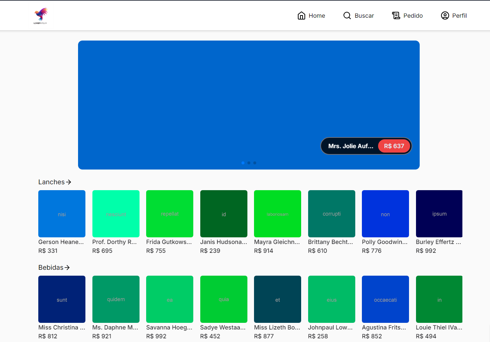
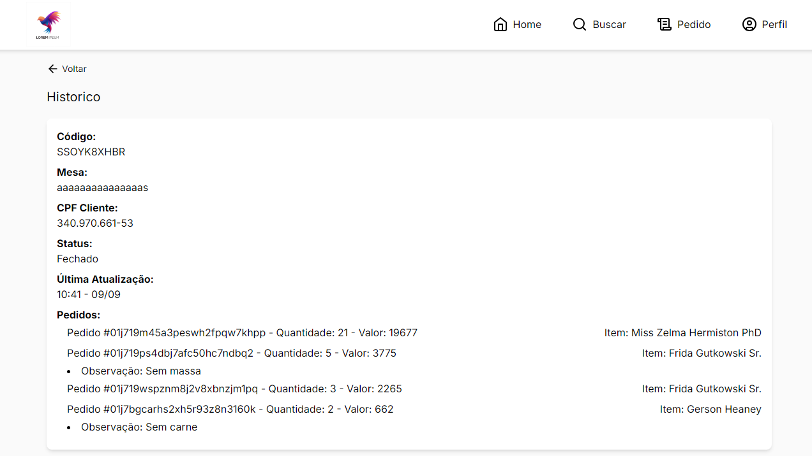

# Sistema Eletrônico para Restaurantes

O sistema de comandas online oferece um serviço conveniente onde os clientes podem acompanhar os seus pedidos em tempo real através do smartphone. Com a integração do CPF do cliente, os pedidos são registrados automaticamente, permitindo que o cliente acompanhe todas as adições e remoções na sua comanda. Esta solução é especialmente útil para estabelecimentos que não possuem um sistema de comandas físicas visíveis para os clientes, garantindo transparência e praticidade em todo o processo de pedido.

## Requisitos do Sistema

Para operar o sistema, são necessários os seguintes requisitos mínimos na sua máquina: PHP, Composer, Node.js e Docker. O PHP e o Composer são essenciais para executar o Laravel, que contém a API principal do sistema. O Node.js é necessário para executar o front-end, enquanto o Docker é utilizado para virtualizar o ambiente no qual a API é executada. Estes componentes garantem a funcionalidade e o desempenho ideais do nosso sistema de forma integrada e eficiente.

## Requisitos Funcionais

- Deve ser possível que o usuário se cadastre;
- Deve ser possível que o usuário se autentique;
- Deve ser possível que o usuário obtenha o perfil de um usuário logado;
- Deve ser possível que o usuário visualize os produtos do estabelecimento;
- Deve ser possível que o usuário acesse o histórico de pedidos;
- Deve ser possível que o usuário busque itens pelo nome;
- Deve ser possível que o usuário busque itens pela categoria;
- Deve ser possível que os administradores realizem consultas ao histórico dos pedidos;
- Deve ser possível que os administradores vejam pedidos em aberto;
- Deve ser possível que os administradores gerenciem pedidos, mesas, itens, categorias e funcionários;
- Deve ser possível que a empresa configure métodos de pagamento.

## Regras de Negócio

- O usuário não deve se cadastrar com um e-mail duplicado;
- O usuário não deve se cadastrar com um CPF duplicado;
- O usuário não pode fazer pedidos sem estar autenticado;
- Os itens só podem ser cadastrados por administradores;
- Os pedidos só podem ser cadastrados por administradores.

## Requisitos Não Funcionais

- A senha do usuário precisa estar criptografada;
- Os dados da aplicação precisam estar persistidos em um banco de dados;
- O usuário deve ser identificado por um token.

## Arquitetura do Sistema

O sistema utiliza as seguintes tecnologias:

- **Linguagens:** PHP, TypeScript
- **Banco de Dados:** MySQL
- **Frameworks:** Laravel, Next.js
- **Arquitetura da API:** MVC, RESTful
- **Outras Tecnologias:** React, Docker

## Como Iniciar o Sistema

### Passo 1: Download dos Arquivos

Clone o repositório:

```bash
git clone https://github.com/andre-albuquerque01/literate-octo-potato.git
```

### Passo 2: Configuração do Back-end

Entre na pasta back-end:

```bash
cd /literate-octo-potato/back-end
```

Inicialize os pacotes do Laravel:

```php
composer install
```

Crie um arquivo `.env` na raiz do seu projeto e configure as variáveis de ambiente conforme necessário.
Execute `php artisan config:cache` para aplicar as configurações do arquivo `.env`.

Inicie o servidor da API:

```bash
sudo ./vendor/bin/sail up
```

Para desativar o servidor da API:

```bash
sudo ./vendor/bin/sail down
```

### Passo 3: Configuração do Front-end

Entre na pasta front-end:

```bash
cd ../front-end
```

Baixe as dependências do Node.js:

```bash
npm i
```

Inicie o servidor do Next.js:

```bash
npm run dev
```

### Passo 4: Acesso ao sistema

Abra o navegador e acesse `http://localhost:3000` para utilizar o serviço.

### Imagens do sistema

## A seguir, apresentamos algumas imagens que demonstram as funcionalidades do sistema:

- Início


- Dashboard



- Pesquisa do Item


- Histórico do Usuário


